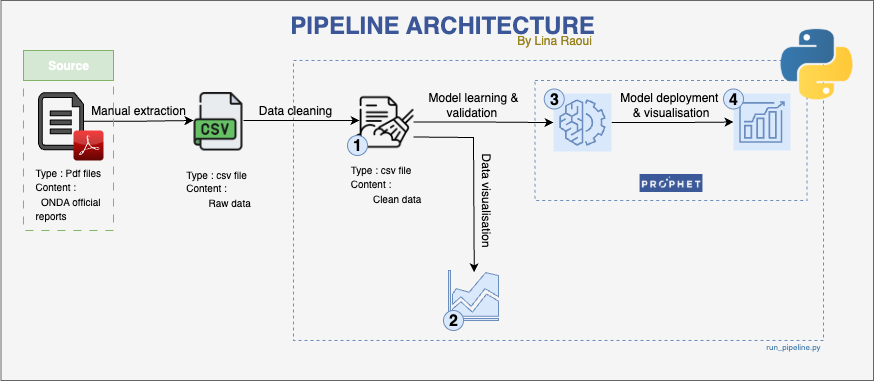
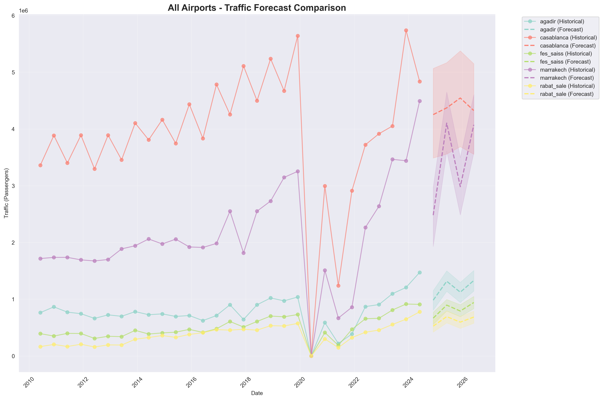

# predictive_analysis_of_moroccan_airport_traffic

i developed this project during my internship at ONDA (Office National des Aéroports) in Morocco. The goal was to design and implement an end-to-end data pipeline to forecast airport passenger traffic using historical data and external signals (e.g. public holidays, sports events ...).

🔧 Tech stack: [](#), [](#), [](#), ,[](#), [](#), [](#)

## Table of Contents
- [Project Overview](#project-overview)
- [Dataset Description](#dataset-description)
- [Pipeline Architecture](#pipeline-architecture)
- [How to Run the Project](#how-to-run-the-project)
- [Results & Visualizations](#results--visualizations)
- [Learnings](#learnings)
- [Future Improvements](#future-improvements)
- [Acknowledgments](#acknowledgments)

## Project Overview

The project focuses on building a scalable, reproducible data pipeline forecasting monthly passenger traffic for key Moroccan airports. It involves:
- Ingesting and cleaning historical traffic data
- Merging external data such as holidays and events
- Engineering features like lag values, seasonality
- Building and evaluating time-series forecasting models
- Delivering visual and tabular outputs


## Dataset Description

- **Main Source:** ONDA historical airport traffic (monthly, per airport)
- **Time Range:** 2010 – 2024
- **Supplementary Sources:** Moroccan public holidays, event calendars
- **Features:** Total passengers, monthly variation, seasonality markers

Data required manual extraction from PDF/Excel formats and included inconsistencies that were handled in preprocessing.

## Pipeline Architecture


It begins with raw Excel files, which are ingested into the processing environment. The data is then cleaned and formatted to ensure consistency, followed by feature engineering to add context such as semester periods, holiday flags, and special events. Using these enriched datasets, the Prophet model generates accurate time-series forecasts. Finally, the results are delivered as reports and charts, making the insights easy to interpret and use.

## How to Run the Project

1. Clone the repository:

```bash
git clone https://github.com/yourusername/onda-traffic-forecasting.git
cd onda-traffic-forecasting
```
2. Install dependencies:
 
```bash
pip install -r requirements.txt
```
3. Run the pipeline:
   
```bash
python run_pipeline.py
```
4. Outputs will be stored in /outputs/ with visualizations and predictions.


## Results & Visualizations

Here is the final traffic forecast per airport:



! For more details check the [Forecast smmary](/docs/outputs/forecast_summary.csv) and [Model metrics](docs/outputs/model_metrics.csv).

## Learnings

This project helped me:
- Design and implement a complete data pipeline
- Handle real-world, messy public-sector data
- Integrate external data into a predictive system
- Communicate results with clarity

## Future Improvements

- Integrate weather and flight delay data
- Move storage to PostgreSQL or BigQuery
- Automate the pipeline with Airflow
- Expose results via Streamlit dashboard
- Scale to all Moroccan airports

## Acknowledgments

Thanks to the ONDA team for their guidance and support during this project.
